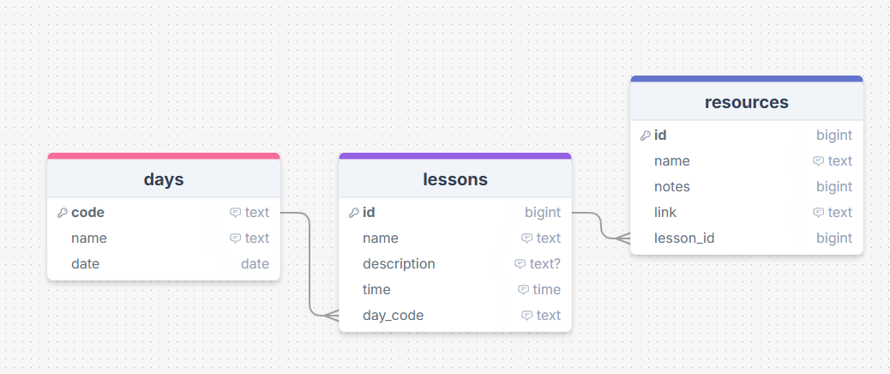
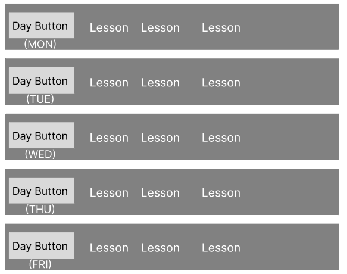

# Sprint 1 - A Working UI Prototype

## Sprint Goals

Develop a prototype that simulates the key functionality of the system, then test and refine it so that it can serve as the model for the next phase of development in Sprint 2.

[Figma](https://www.figma.com/) is used to develop the prototype.

---

## Initial Database Design

This first design of a database allows for each day of the week to have lessons assigned to it. Lessons can have notes and resources attached to it as well.

---

## UI 'Flow'

The first stage of prototyping was to explore how the UI might 'flow' between states, based on the required functionality.

This Figma demo shows the initial design for the UI 'flow':

<iframe style="border: 1px solid rgba(0, 0, 0, 0.1);" width="800" height="450" src="https://embed.figma.com/proto/UpFjZROYkeZsZAiStpX9eY/Flow?node-id=1-3&p=f&scaling=contain&content-scaling=fixed&page-id=0%3A1&starting-point-node-id=1%3A3&embed-host=share" allowfullscreen></iframe>

### Testing

When I showed my Figma Design for the UI flow of my project to my mother, who is a teacher and the end-user of my project, I mostly got positive feedback, but there were some changes I could make to improve the user's experience and help users understand how to navigate the application.

### Changes / Improvements

#### Displaying lessons

The end-user said that having each lesson open to a separate page when click on it could get a bit confusing, as well as being slow to navigate. To help this, I made it so that all the details for each lesson were displayed on the day overview page.

#### Resources

My end-user said that having to open a new page to add a resource wasn't needed, and as there wasn't much information for a resource that needed to be added, it could be done from the resources page to make it faster and easier.

One other bit of feedback I had was that accessing the resources was hard because the only way it could be reached was through the lesson view where the resources could be seen for a lesson. I added a navigation through to the resources page from the home page to allow easier navigation.

Updated User Interface Flow design.
<iframe style="border: 1px solid rgba(0, 0, 0, 0.1);" width="800" height="450" src="https://embed.figma.com/proto/t2SXLKKi8tbRRxeBae6OVS/Flow--Copy-?node-id=1-3&p=f&scaling=contain&content-scaling=fixed&page-id=0%3A1&starting-point-node-id=1%3A3&embed-host=share" allowfullscreen></iframe>

---

## Initial UI Prototype

The next stage of prototyping was to develop the layout for each screen of the UI.

This Figma demo shows the initial layout design for the UI:

<iframe style="border: 1px solid rgba(0, 0, 0, 0.1);" width="800" height="450" src="https://embed.figma.com/proto/9o7kaYPTT1KXkWoocYRqqH/Prototype--Copy-?node-id=1-3&p=f&scaling=contain&content-scaling=fixed&page-id=0%3A1&starting-point-node-id=1%3A3&embed-host=share" allowfullscreen></iframe>

### Testing

I tested the prototyped UI with my end-user to see if the layouts and page navigation would work well for this project and meet the requirements of my end user. There was some feedback in terms of layout and functionality to ensure that the application was easy to use and understand, and also was familiar to teachers, who will the the primary users.

### Changes / Improvements

#### Vertical Days on week display

My initial design had the days displayed in rows, and my end-user said that most teaching resources display days of the week using columns, and it would be more familiar and comfortable for most teachers if the days were columns instead of rows.

Original:

New:

My end-user said that the change was good when I presented the new version.

#### Displaying lessons

Due to my previous end user feedback in the Flow design. I made it so that all the details for each lesson were displayed on the day overview page, but when I showed this new version to my end-user in this UI prototype, she said that the page could end up being cluttered and confusing with all the info for multiple lessons being onscreen at once and I should make it so that the details for lessons can be shown and hidden to reduce confusion and make the application easier to use.

I redesigned the lessons to be a dropdown that will display the details of the lesson when clicked, meaning that only the info for a specific lesson is shown at once. Which my end-user said was a much better solution that made the site more efficient and easier to use.

<iframe style="border: 1px solid rgba(0, 0, 0, 0.1);" width="800" height="450" src="https://embed.figma.com/proto/CFCr7Gb2JYkCOzlKJsgVxc/Prototype?node-id=1-3&p=f&scaling=contain&content-scaling=fixed&page-id=0%3A1&starting-point-node-id=1%3A3&embed-host=share" allowfullscreen></iframe>

---

## Refined UI Prototype

Having established the layout of the UI screens, the prototype was refined visually, in terms of colour, fonts, etc.

This Figma demo shows the UI with refinements applied:

*FIGMA REFINED PROTOTYPE - PLACE THE FIGMA EMBED CODE HERE - MAKE SURE IT IS SET SO THAT EVERYONE CAN ACCESS IT*

### Testing

Replace this text with notes about what you did to test the UI flow and the outcome of the testing.

### Changes / Improvements

Replace this text with notes any improvements you made as a result of the testing.

*FIGMA IMPROVED REFINED PROTOTYPE - PLACE THE FIGMA EMBED CODE HERE - MAKE SURE IT IS SET SO THAT EVERYONE CAN ACCESS IT*

---

## Sprint Review

Replace this text with a statement about how the sprint has moved the project forward - key success point, any things that didn't go so well, etc.

