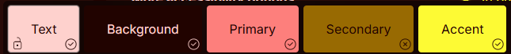
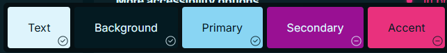
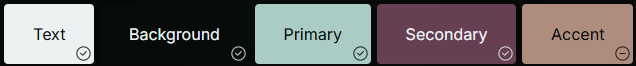
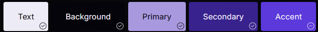
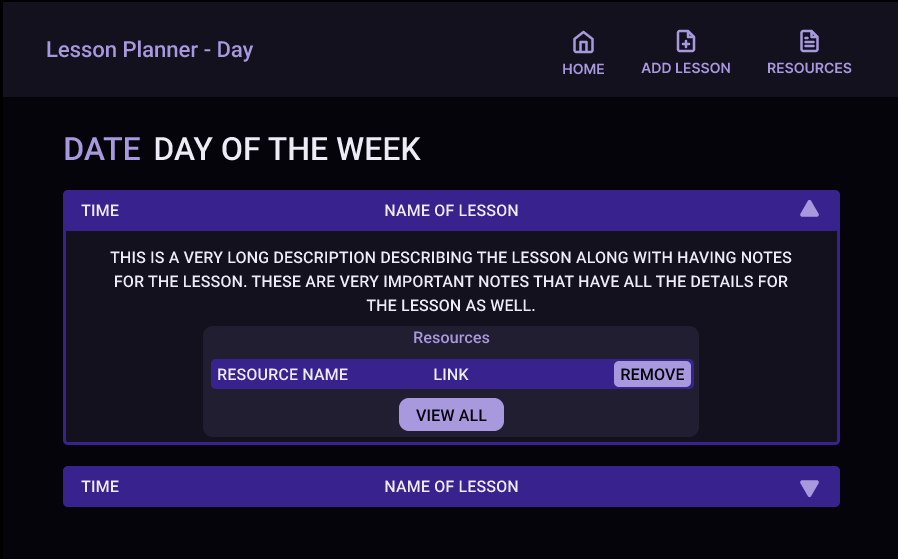
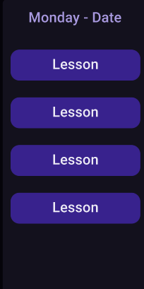
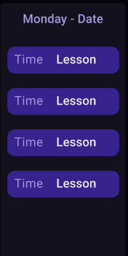

# Sprint 1 - A Working UI Prototype

## Sprint Goals

Develop a prototype that simulates the key functionality of the system, then test and refine it so that it can serve as the model for the next phase of development in Sprint 2.

[Figma](https://www.figma.com/) is used to develop the prototype.

---

## Initial Database Design

This first design of a database allows for each day of the week to have lessons assigned to it. Lessons can have notes and resources attached to it as well.

---

## UI 'Flow'

The first stage of prototyping was to explore how the UI might 'flow' between states, based on the required functionality.

This Figma demo shows the initial design for the UI 'flow':

<iframe style="border: 1px solid rgba(0, 0, 0, 0.1);" width="800" height="450" src="https://embed.figma.com/proto/UpFjZROYkeZsZAiStpX9eY/Flow?node-id=1-3&p=f&scaling=contain&content-scaling=fixed&page-id=0%3A1&starting-point-node-id=1%3A3&embed-host=share" allowfullscreen></iframe>

### Testing

When I showed my Figma Design for the UI flow of my project to my mother, who is a teacher and the end-user of my project, I mostly got positive feedback, but there were some changes I could make to improve the user's experience and help users understand how to navigate the application.

### Changes / Improvements

#### Displaying lessons

The end-user said that having each lesson open to a separate page when click on it could get a bit confusing, as well as being slow to navigate. To help this, I made it so that all the details for each lesson were displayed on the day overview page.

#### Resources

My end-user said that having to open a new page to add a resource wasn't needed, and as there wasn't much information for a resource that needed to be added, it could be done from the resources page to make it faster and easier.

One other bit of feedback I had was that accessing the resources was hard because the only way it could be reached was through the lesson view where the resources could be seen for a lesson. I added a navigation through to the resources page from the home page to allow easier navigation.

Updated User Interface Flow design.
<iframe style="border: 1px solid rgba(0, 0, 0, 0.1);" width="800" height="450" src="https://embed.figma.com/proto/t2SXLKKi8tbRRxeBae6OVS/Flow--Copy-?node-id=1-3&p=f&scaling=contain&content-scaling=fixed&page-id=0%3A1&starting-point-node-id=1%3A3&embed-host=share" allowfullscreen></iframe>

---

## Initial UI Prototype

The next stage of prototyping was to develop the layout for each screen of the UI.

This Figma demo shows the initial layout design for the UI:

<iframe style="border: 1px solid rgba(0, 0, 0, 0.1);" width="800" height="450" src="https://embed.figma.com/proto/9o7kaYPTT1KXkWoocYRqqH/Prototype--Copy-?node-id=1-3&p=f&scaling=contain&content-scaling=fixed&page-id=0%3A1&starting-point-node-id=1%3A3&embed-host=share" allowfullscreen></iframe>

### Testing

I tested the prototyped UI with my end-user to see if the layouts and page navigation would work well for this project and meet the requirements of my end user. There was some feedback in terms of layout and functionality to ensure that the application was easy to use and understand, and also was familiar to teachers, who will the the primary users.

### Changes / Improvements

#### Vertical Days on week display

My initial design had the days displayed in rows, and my end-user said that most teaching resources display days of the week using columns, and it would be more familiar and comfortable for most teachers if the days were columns instead of rows.

Original:

New:

My end-user said that the change was good when I presented the new version.

#### Displaying lessons

Due to my previous end user feedback in the Flow design. I made it so that all the details for each lesson were displayed on the day overview page, but when I showed this new version to my end-user in this UI prototype, she said that the page could end up being cluttered and confusing with all the info for multiple lessons being onscreen at once and I should make it so that the details for lessons can be shown and hidden to reduce confusion and make the application easier to use.

I redesigned the lessons to be a dropdown that will display the details of the lesson when clicked, meaning that only the info for a specific lesson is shown at once. Which my end-user said was a much better solution that made the site more efficient and easier to use.

<iframe style="border: 1px solid rgba(0, 0, 0, 0.1);" width="800" height="450" src="https://embed.figma.com/proto/CFCr7Gb2JYkCOzlKJsgVxc/Prototype?node-id=1-3&p=f&scaling=contain&content-scaling=fixed&page-id=0%3A1&starting-point-node-id=1%3A3&embed-host=share" allowfullscreen></iframe>

---

## Refined UI Prototype

Having established the layout of the UI screens, the prototype was refined visually, in terms of colour, fonts, etc.

This Figma demo shows the UI with refinements applied:

<iframe style="border: 1px solid rgba(0, 0, 0, 0.1);" width="800" height="450" src="https://embed.figma.com/proto/do5EUVjTaCTzlDDNU7uen4/Lesson-Planner-UI-Design?scaling=contain&content-scaling=fixed&page-id=0%3A1&node-id=1-4&embed-host=share" allowfullscreen></iframe>

### Testing

I tested my Figma UI designs along with colour schemes to my End-User to get an idea of how the actual application will look, and whether or not it functions well for its purpose, and looks clear, navigable and accessible to users. 

### Changes / Improvements

#### Colours

I used the realtime colors website to help choose a colour scheme for the application that is aesthetic, but also clear and easy to navigate. I showed multiple colour schemes to my end-user to get feedback on them and to see what would fit best with the site.

My end user said that with a scheme like this, the background wasn't dark enough and didn't contrast well against the other colours. She also thought that these sort of colours would not fit well with the application.

My end user thought that a colour scheme like this would be too bright and busy, which would slow down navigation for some users, and could cause some to struggle with using the website.

This one had some positive feedback, saying that the dark background contrasted well and the other colours work well together, and are easy on the eyes.

My end user liked this one the most, saying that the blues worked well on the black background, and the other blues worked well together making the site easier to navigate and understand at a glance, the colours weren't so muted that they didn't contrast, but they also weren't busy and bright.

I added this colour scheme to my UI and my End-user said that it looked well and fitted with the functionality of the website as the colours work well together but also contrast well making the website easier to navigate but also more aesthetic.

#### Time in week view

My end-user said that it would be very helpful if the week view had the times of the lessons as well to make it easier at a glance to see when things are happening. I replaced the original lesson tiles with new ones that also displayed the time as well.

My end-user thought that this was a much better version as the time shpuld be seeable at a glance as it is important.

<iframe style="border: 1px solid rgba(0, 0, 0, 0.1);" width="800" height="450" src="https://embed.figma.com/proto/TNjevGghWDFRBFwd5bT0lL/Lesson-Planner-UI-Design--Copy-?node-id=1-4&p=f&scaling=contain&content-scaling=fixed&page-id=0%3A1&embed-host=share" allowfullscreen></iframe>

---

## Sprint Review

The sprint resulted in me having an idea of how my application will function, as well as the aesthetics and design of the website. My end-user is pleased with the outcome of the design and layout of the site, saying that it fits its purpose well. Feedback from my End-user allowed me to create a better outcome that will function more as intended. I now also have a good idea of what I'm aiming for moving forward with making a minimum viable product.
