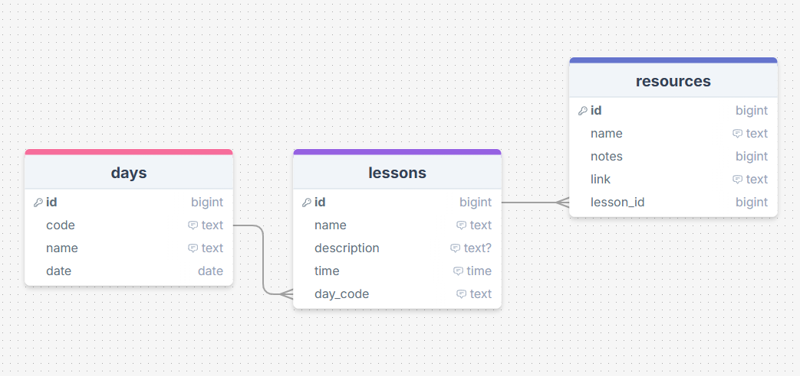

# Sprint 2 - A Minimum Viable Product (MVP)

## Sprint Goals

Develop a bare-bones, working web application that provides the key functionality of the system, then test and refine it so that it can serve as the basis for the final phase of development in Sprint 3.

---

## Implemented Database Schema

I used a similar database to the one I planned, but added an ID to days to make them be able to be ordered and retrieved correctly.

---

## Initial Implementation

The key functionality of the web app was implemented:

---

## Testing Dropdown menus on for days

My initial dropdown menu system used the lesson id to find the dropdown that should be active to display the content, this meant that only one dropdown could be open at a time, and the page had to be reloaded each time. This made for a slow, inefficient system and my end user agreed that it needed improvement.

### Changes / Improvements

I made it so that multiple dropdowns could be opened and closed at the same time but it was still slow as it required the page to be reloaded each time. My end user thought that being able to view multiple dropdowns increased efficiency a lot but it still was slow and bad to use.

I completely changed the way I was doing dropdowns, instead replacing it with a javascript file that uses the lesson id and classes to find and change the states of whatever dropdown was clicked, this allowed for instant use of the dropdowns, as well as having as many open as needed at any time. My end user said that this was a much better system that increased the functionality and useability of my application by a lot.

---

## Testing Time displaying for lessons

My end user noticed that initially the lesson times were displaying poorly and in 24hr time, and didnt order correctly. It made the times harder to read at a glance and it was difficult to understand what time lessons were actually set for.

### Changes / Improvements

I replaced the way that time was inputted, using pico css inbuilt time for forms, this returned a string that would display in 24 hours and order correctly as it was formatted automatically.

When I showed this fix to my end user, I got more feedback saying that for readability, the time should be in 12hr time instead. I made use of the time and date formatting script provided to format this time into a 12 hour readable format that was not confusing.

---

## Testing Resource displaying for lesson

If lessons don't have any resources, it still displays as if there are, making it confusing for the user. My end-user said that setting up a different display for not having any resources would make it more clear.

### Changes / Improvements

Using a Jinja filter, I can get only the relevant resources, which allows for the resources to display properly and work if there are none, rather than the old system which got all and sorted through them, meaning that even if none were showing, there where still resources there and it wouldn't dislay 'No Resources'

---

## Testing Editing Resource

Once a resource was created, you could not change anything about it and had to delete it then add a new one if you wanted to change anything. My end-user said that resources can change a lot or need details updated so being able to edit the resource whenever would allow for the website to be more efficient to use and also would be easier for users.

### Changes / Improvements

I made it so that the name, link and notes were able to be edited, but my end user said that the resource should be able to be shuffled between lessons if needed. So I changed the editing form so that it would find the lesson that the resource was attached to and allow it to be changed from a dropdown menu. From further feedback I made the original lesson display at the top of the dropdown so users can set it back if they decide against changing it but don't remember what it was originally.

---

## Testing opening resource links

Resource links didn't open in a new tab and instead just loaded over the web application, my end-user thought that this was bad as it didnt allow for efficiency and would result in users losing the website while they are trying to use it.

### Changes / Improvements

I changed how the url is opened so it opens in a new tab instead of using the one already open. My end user agreed that this makes the website better to use as the page wont be lost when opening links and allows for resources to easily be opened and viewed.

---

## Sprint Review

Replace this text with a statement about how the sprint has moved the project forward - key success point, any things that didn't go so well, etc.

