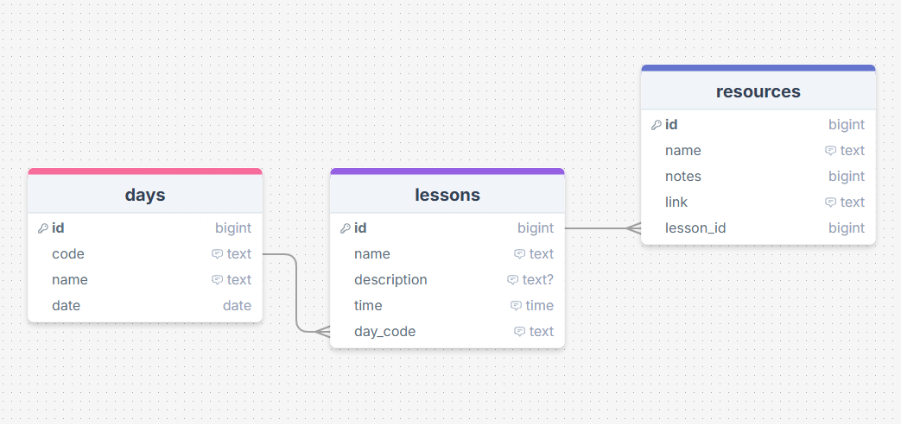
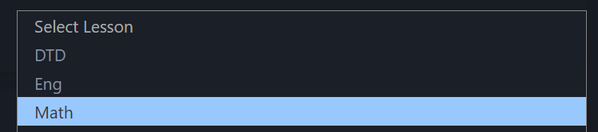
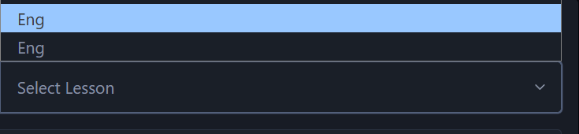
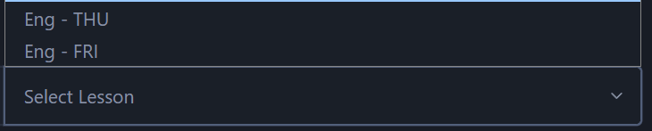
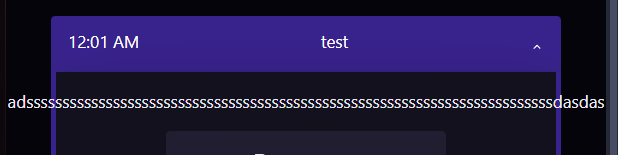
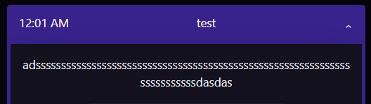
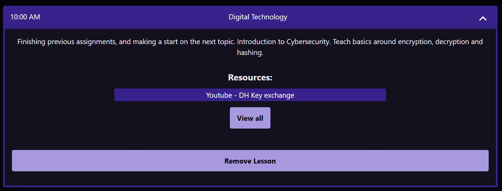
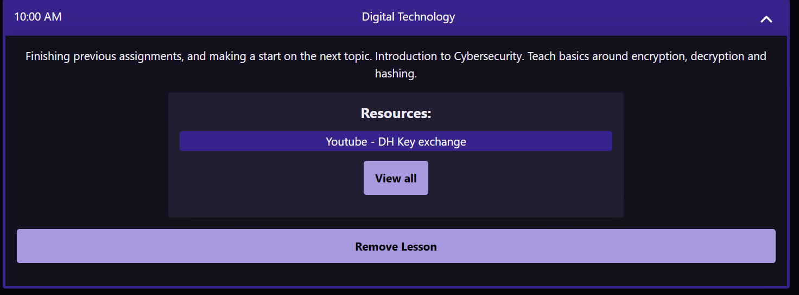
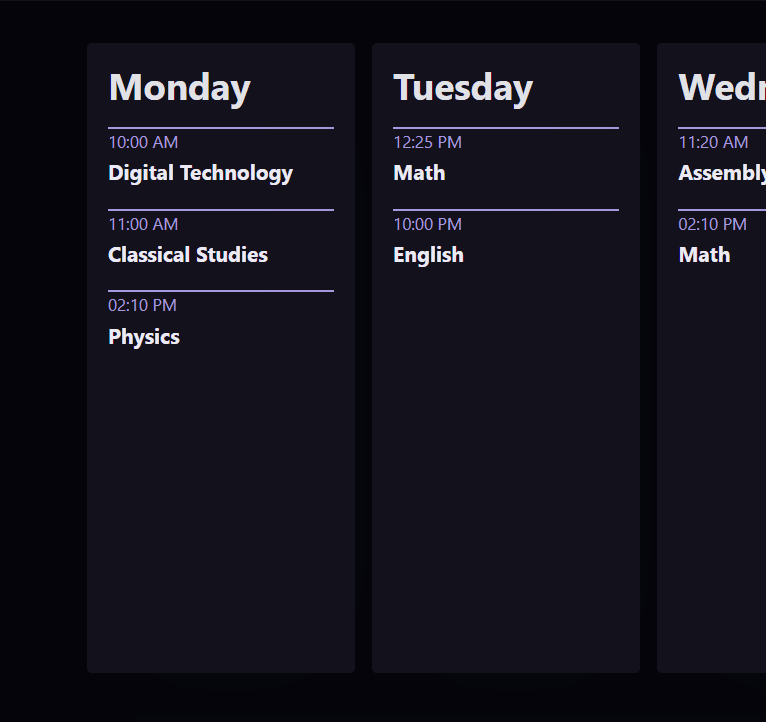

# Sprint 3 - A Refined and Complete System

## Sprint Goals

Develop the system until it is fully featured, with a refined UI and it satisfies the requirements. The system will be fully tested at this point.

---

## Updated Database Scheme (If it changed)

The Database remains the same as no changes were needed for the final impementaion from the original functioning page.

---

## Final Implementation

While Designing the website, I discovered a major bug that occured when deleting a lesson that has resources connected to it. The lesson gets deleted but the resource remains, keeping the ID of the lesson saved, so when the resource is interacted with, an error is thrown as the resource has an out of bounds lesson_id parameter. To solve this I made it also delete resources connected to that lesson when the lesson is deleted.

Showing this to my end-user, I got feedback saying that it would be better if the user had and option to delete or reassign, as the resources could still be used or needed by the user. To achieve this i set up a system that allows the conflicting resources to be reassigned to a new lesson or deleted, to prevent errors.

---

## Resources lesson clarification

One of the things my end-user commented on was the lessons listing when creating or editing a resource. Currently it will just display all the options by name, and the user can select the lesson, however my end user said that there may be multiple of the same or similar lessons in a week and it should be clear which one is which.

### Changes / Improvements

To solve this, I made the lessons display what day they are as well, making it a lot more obvious which lesson is which. I showed this to my end user who agreed it looked better and was more clear for the user. Doing this introduced a bug, because the name of the lesson displaying wasn't exactly the same as the real lessons name in the database as it was also including the day. Since the way it is formated and the fact is uses the 3 character day code, I can remove the last 6 characters from the string ( - MON) which will return it back to the exact lesson name everytime so it can be checked with the database.

---

## Testing Web app use on different devices

The webapp was created on a pc and therefore was only designed to work properly on that device, other devices with smaller screen sizes or differnt aspect ratios could lead to content not displaying correctly. For example on phone screens a lot of the time the text would not be wrapping correctly and would go off the page, or elemements could be squished too much to be readable or useable. My end-user said that a lesson planner would likely be used on a wide range of devices like phones, laptops and desktops as it would be helpful for users to be able to access and change the information and see their plan from anywhere at any time. This means I need to make the application would on a wide variety of screen sizes to make it compatible with these devices.

### Changes / Improvements

I went through the web app and found areas that the website doesnt work at small screen sizes, adjusting where necessary. I found quite a few examples where this occured, and got things to correctly format/ wrap where necessary to display well on any screen. I showed this to my end-user who thought it was better, but had feedback on some other parts saying that they should be adjusted slightly to make it even more clear on smaller screens, for example, reducing the full day display on the homepage to just the first 3 characters to make it more understandable on slim devices where the test could still overlap.

Another example i found was in the resources list where the link and the name could overlap a lot and be pushed off the screen on smaller sizes, so I formatted it to display the Link and the name as one element on small screens, saving space and making the site more readable to users. When I showed this final iteration to my end-user, it was appreciated a lot I got feedback saying that it worked well on a lot of devices and was much more accesible to users that couldn't access a computer.

---

## Colour Scheme Implementation

Using the colour scheme that was decided on by the end user, I redesigned the site to use these colours in the same way that was in the plan for the site, and showed this to my end-user, who went through the site testing it with the new colours. The Initial colour scheme did fit well and was very readable for users, however there were some areas that could use some slight colour changes for clarity. One example of this was with the resources in a lesson, which didn't stand out against the rest of the lesson, which could make it a bit confusing.

### Changes / Improvements

I went through places that could benefit from colour changes for clarity, deviating from the colour scheme slightly with lighter or darker shades of the colour scheme to help group things together for clarity. Below is the same lesson dropdown with the updated colours.

This makes groups and different elements look a lot better, improving clarity for users and helping stop them from getting lost. My end-user thought that this was a very good change, but also suggested that for further clarity I should use these different colours on things like links and buttons to make it more obvious that they can be interacted with.
I went through the interactable elements adding a hover effect which made them a lot more obvious to users that they could click on these elements. My end-user thought that this was also a great change when shown it.

Old:

Improved:

---

## Testing FEATURE NAME HERE

Replace this text with notes about what you are testing, how you tested it, and the outcome of the testing

**PLACE SCREENSHOTS AND/OR ANIMATED GIFS OF THE TESTING HERE**

### Changes / Improvements

Replace this text with notes any improvements you made as a result of the testing.

**PLACE SCREENSHOTS AND/OR ANIMATED GIFS OF THE IMPROVED SYSTEM HERE**

---

## Testing FEATURE NAME HERE

Replace this text with notes about what you are testing, how you tested it, and the outcome of the testing

**PLACE SCREENSHOTS AND/OR ANIMATED GIFS OF THE TESTING HERE**

### Changes / Improvements

Replace this text with notes any improvements you made as a result of the testing.

**PLACE SCREENSHOTS AND/OR ANIMATED GIFS OF THE IMPROVED SYSTEM HERE**

---

## Sprint Review

Replace this text with a statement about how the sprint has moved the project forward - key success point, any things that didn't go so well, etc.

